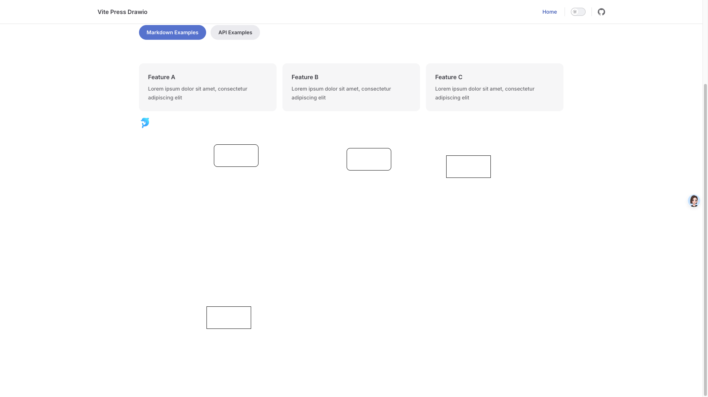

# vitepress-plugin-drawio

A VitePress plugin for rendering drawio diagrams.

## Installation
```bash
npm install @dhlx/vitepress-plugin-drawio
```
## Usage

set the `drawioPlugin` in the `vitepress.config.ts` file.

```ts
// .vitepress/config.ts
import { defineConfig } from 'vitepress'
import withDrawio from '@dhlx/vitepress-plugin-drawio'
export default withDrawio(defineConfig({
  
}), {
    // default page
    // set default width， default： 100%
    width: "100%",
    // set default height，default： 600px
    height: "600px",
    // start page 0
    page: 0,
    // set page title
    // dark mode，default： auto, options： light, dark, auto
    "darkMode": "auto",
    // enable toolbar resize，default： false
    resize: false,

    // enable toolbar change pages，default： false
    pages: false,
    // enable toolbar zoom，default： false
    zoom: false,

    // enable toolbar layers，default： false
    layers: false,

    // enable toolbar lightbox，default： false
    lightbox: false,

})

```

## Example

```md
{edit=_blank transparent=1 nav=1  }
```
`{}` is the attribute of the drawio diagram. You can set the attribute in the `vitepress.config.ts` file.

if you set the `transparent=1`，the background will be transparent. 

other attribute will be override the `vitepress.config.ts` file.



